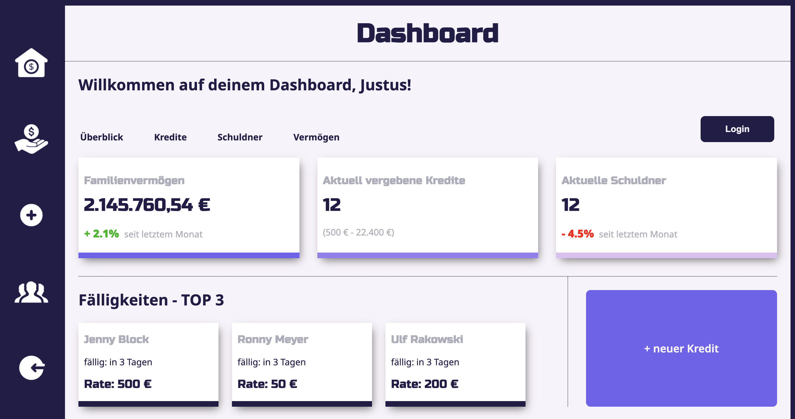
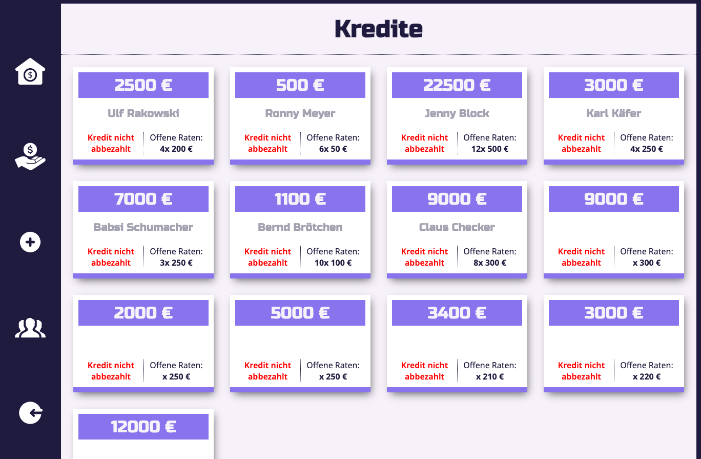
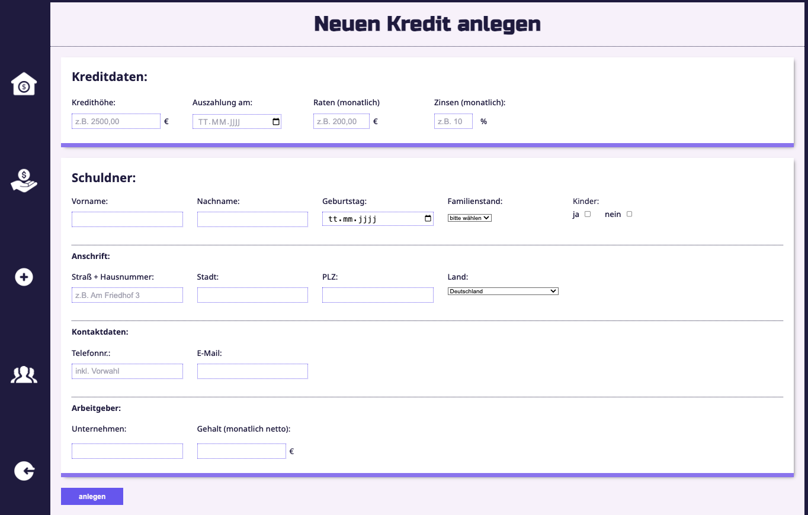

# "family.business" 💰

Welcome to "family.business" - a debt collector app for the young, aspiring Justus (25, business student, spoiled brat), who wants to join the family business (lending money for a healthy portion of interest).

He wants to use the app to:

- get an overview of the loans currently granted 🏦
- quickly identify which debtors are in arrears with their payments 🧑‍🦱 --> ⛓️🧱⚓️ --> 🌊🐟 --> 💵
- create new loans (and debtors) 🙆💸
- edit or delete loans ✏️
- keep an eye on family assets (more, more, more...) 💰💰💰

🚧🚧🚧🚧 The app is currently still under construction... 🚧🚧🚧🚧

If you would like to have a little insight now, you can find some screenshots down below.

---

This project was created as part of a coding bootcamp (fullstack development) at SuperCode GmbH.

## Screenshots 📸

### Dashboard:

### View all loans:

### Add a new loan:

## Author 👩‍💻

[@MoniqueHeusinger](https://github.com/MoniqueHeusinger)
